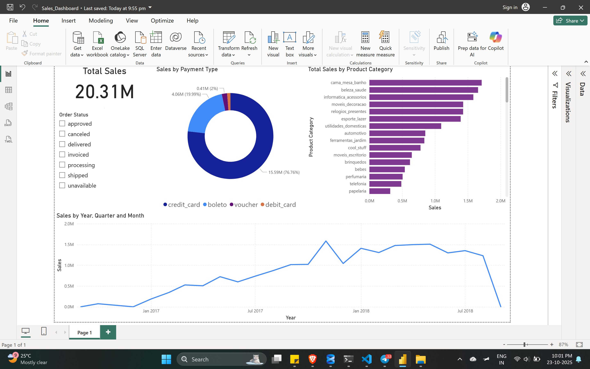

# E-Commerce Sales Analysis (Olist Dataset)

## Project Overview
This project is an end-to-end data analysis of the Olist E-commerce dataset (a Brazilian online retailer). The goal is to analyze sales trends, identify top-performing product categories, and understand customer payment behavior to provide actionable insights for the business.

This project demonstrates skills in:
* SQL Database Management
* Complex SQL Queries (Multi-table JOINs)
* Data Extraction with Python (Pandas)
* Interactive Dashboard building in Power BI

## Tools Used
* **Database:** Microsoft SQL Server
* **Data Extraction:** Python (with `pandas` and `pyodbc` libraries)
* **Data Visualization:** Microsoft Power BI

## The Process
1.  **Database Setup:** Loaded 6 raw CSV files (customers, orders, items, payments, products, sellers) into a new `OlistCommerce` database on MS SQL Server.
2.  **SQL Analysis:** Wrote a single, complex SQL query to `JOIN` the tables, creating a master data source with all necessary columns (e.g., `order_status`, `price`, `payment_value`, `product_category_name`).
3.  **Python Scripting:** Created a Python script (`get_data.py`) using `pandas` and `pyodbc` to connect to the SQL Server, execute the master query, and export the clean, combined data into a single `olist_master_data.csv` file.
4.  **Dashboard Creation:** Connected the final CSV to Power BI and built an interactive dashboard to visualize the findings.

## Final Dashboard
Here is a screenshot of the final dashboard.

## Key Insights
* **Total Sales:** The company generated **20.31M** in total sales from the dataset.
* **Top Category:** The **'cama_mesa_banho'** (bed, table, bath) category is the highest-grossing.
* **Payment Behavior:** **Credit Card** is the dominant payment method, used in over **76%** of all transactions.
* **Order Status:** Over **97.3%** of all sales revenue came from successfully **"delivered"** orders, indicating strong logistics performance.
